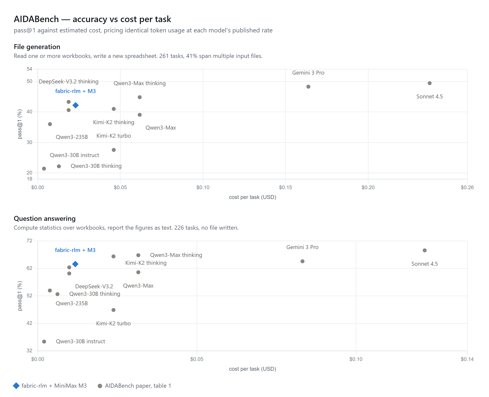

# fabric-rlm on AIDABench

Reproduction material for running [fabric-rlm](https://github.com/pawarbi/fabric-rlm-core)
against [AIDABench](https://github.com/MichaelYang-lyx/AIDABench)
([arXiv 2603.15636](https://arxiv.org/abs/2603.15636)).

Everything here exists so the numbers can be checked rather than taken on trust:
the runner, both graders, every trajectory, and the calibration that says how far
our cheap grader can be trusted against the official one.



Costs are estimated, not observed — see [Cost estimates](#cost-estimates) for the
method and its biases. `assets/chart.html` regenerates the figure.

---

## Results

AIDABench reports pass@1 per category. We ran two of its three splits.

### File generation (261 tasks; 251 runnable, 235 completed)

| model | pass@1 | est. $/task | source |
|---|---|---|---|
| claude-sonnet-4.5 | 49.43 | 0.237 | paper, table 1 |
| gemini-3-pro-preview | 48.28 | 0.164 | paper, table 1 |
| qwen3-max-thinking | 44.83 | 0.062 | paper, table 1 |
| deepseek-v3.2-thinking | 43.30 | 0.019 | paper, table 1 |
| **fabric-rlm + MiniMax M3** | **~42** | **0.023** | **this repo** |
| kimi-k2-thinking | 41.00 | 0.046 | paper, table 1 |
| deepseek-v3.2 | 40.61 | 0.019 | paper, table 1 |

### Question answering (226 tasks; 225 run)

| model | pass@1 | est. $/task | source |
|---|---|---|---|
| claude-sonnet-4.5 | 68.58 | 0.122 | paper, table 1 |
| qwen3-max-thinking | 66.81 | 0.032 | paper, table 1 |
| kimi-k2-thinking | 66.37 | 0.024 | paper, table 1 |
| gemini-3-pro-preview | 64.60 | 0.083 | paper, table 1 |
| **fabric-rlm + MiniMax M3** | **63.6** | **0.012** | **this repo** |
| deepseek-v3.2-thinking | 62.39 | 0.010 | paper, table 1 |

### Alternative models, same harness

Every model below ran the identical harness on the same 60 file-generation
tasks, paired against MiniMax M3 and compared with McNemar's exact test.

| model | pass | M3, same tasks | p | $/task |
|---|---|---|---|---|
| DeepSeek V4 Flash | 21.7% | 20.0% | 1.000 | 0.010 (0.4x M3) |
| DeepSeek V4 Pro | 20.0% | 20.0% | 1.000 | 0.030 (1.3x M3) |
| Gemini 3.6 Flash | 13.3% | 20.0% | 0.289 | 0.181 (7.9x M3) |

Cell-exact scoring, so the absolute values are far below the judged numbers
above; only the paired comparison is meaningful.

None beats M3. **DeepSeek V4 Flash matches it at 40% of the cost** with 6.4x the
context window, which makes it the better default on price. V4 Pro costs 1.3x
Flash for nominally fewer passes. Gemini 3.6 Flash is the only model that fits
the harness differently — 9.2 turns against M3's 6.7 — and the only one that
scored worse.

At n=60 with a measured 84% self-agreement between identical runs, these rule
out large differences and nothing finer.

### Data visualization

Not run. The deliverable is a chart image graded on presentation rubrics, which
needs a vision-capable judge and chart-construction guidance that fabric-rlm does
not ship. Out of scope, not a result.

---

## How each number was produced

### The runs

One RLM per task, single attempt, no retries or best-of-N.

```
model         openrouter/minimax/minimax-m3, provider pinned to minimax/fp8
temperature   1.0
max_turns     14
skill         excel_modify (file generation) / data_exploration (QA)
              docx_documents or pdf_document_analysis when inputs call for it
context       first 5 rows of each input file, for orientation
```

The input preview is deliberately leak-free. `eval_area` — the graded cell range —
is a grading detail the model is never told; only 1 of 261 questions states its
own range. Passing it in would hand over the answer location. The preview shows
only what a person sees on opening the file.

### File generation grading

Two graders, because they measure different things:

**The official evaluator** (`scripts/aida_official_eval.py`) runs AIDABench's own
`FileEvaluatorAgent` unmodified — Claude Sonnet 4.5 as an agent with up to 30
rounds, executing Python to inspect both workbooks directly. This is the
instrument that produced their published table. It costs roughly **$0.50/task**,
so a full 251-task pass is about $125.

**Our judge** (`scripts/judge_aida.py`) is a single call per task with a 60-row
preview plus whole-file row and column counts. About **$0.023/task**.

We ran the official evaluator on a **62-task random sample** and compared:

| | score on those 62 |
|---|---|
| official evaluator | 41.9% |
| our judge | 43.5% |
| cell-exact (strict, ours) | 29.0% |

**Agreement 75.8%, Cohen's kappa 0.506, net bias +1.6 points.**

Read that carefully: the errors cancel in aggregate but not per task. Our judge
is usable for a population estimate and **not** usable for deciding whether any
individual task passed. Raw verdicts from both are in `calibration/`.

A third grader, cell-exact comparison over `eval_area`, is recorded in the
results but is **not comparable to anything AIDABench publishes** — their
evaluator ignores `eval_area` entirely. It exists here as a debugging instrument;
the gap between it and the judges is what exposed most of the harness bugs listed
below.

### QA grading

AIDABench's `eval_QA.py`, unmodified — a single chat completion scoring 0 or 1
against the reference answer.

Their configured grader, `qwq-32b`, is no longer served by OpenRouter, so a
substitute was required. We ran two of different size to check the number is
about the run rather than the grader:

| grader | over all 225 tasks |
|---|---|
| Qwen3-235B | **63.6%** |
| Gemma-4-31B (closest in class to their 32B qwq) | 66.2% |

**Agreement 94.6%, kappa 0.881** on 223 shared tasks (McNemar p=0.146). We quote
**63.6%** — the stricter grader, over the full task set. The honest band is
63–66%.

### Cost estimates

Every `$/task` figure prices **our measured token usage** at each model's
published OpenRouter rate on 2026-07-27:

- file generation: 64,955 prompt + 2,820 completion tokens/task
- QA: 35,175 prompt + 1,074 completion tokens/task

This is a same-workload comparison, not observed spend — AIDABench published no
cost figures. Three things bias it, all in the same direction:

- **Thinking models are undercharged.** They emit far more output than we do.
  Measured directly: Gemini 3.6 Flash used 5,879 completion tokens/task against
  M3's 3,048, making it 8.3x our cost rather than the 5x its rate card implies.
- **Their agent is stateless** (no persistent namespace, up to 20 rounds), so it
  resends state each round. Real prompt volume is likely above ours.
- **Two prices are proxies.** `gemini-3-pro-preview` is delisted (used Gemini 3.1
  Pro, $2/$12); `deepseek-v3.2-thinking` has no separate listing (used the base
  model's rate).

---

## What we are not claiming

- **Not an official submission.** Our own runs, scored with their methodology.
- **Single seed.** Two identical M3 runs on the same 91 tasks agreed on only
  **84%** of them. Anything under ~10 points is inside run-to-run noise at these
  sample sizes.
- **10 of 261 file-generation tasks excluded** as ungradable — `eval_area` names
  a sheet absent from the reference for reasons no parser can resolve. Their
  numbers presumably cover the full split. Excluded ids are printed by the runner
  and listed in `results/`.
- **235 of 251 file-generation tasks completed.** The rest were lost to harness
  failures during development, not model failures.

---

## Things that went wrong, and what they cost

Recorded because a benchmark without its failures is a marketing document. Every
one of these made fabric-rlm look worse than it is, and each was invisible until
individual cells were inspected.

| what | effect |
|---|---|
| Graded only worksheet 0 | 21% of tasks name a sheet in `eval_area`; wrong sheet compared |
| `eval_area` parsed as a bare range | 40% of tasks use sheet-qualified, bracketed, or file-qualified forms |
| Sheet names matched exactly | Excel truncates at 31 chars; 23 references unmatchable, 18 recoverable |
| Numbers compared as strings | reference `"66.0"` vs produced `66` scored as a mismatch |
| `reference_file` read as one filename | it is a newline-separated list; 13 tasks silently excluded |
| Only openpyxl used for grading | 8% of outputs are csv/xls; failed on format alone |
| Benchmark data under OneDrive | official evaluator's sandbox refuses that path — produced a **fake 18.4%** and cost $45 |

Two runs were also destroyed by concurrent writes to the same results file, and
one died on a Windows console encoding error 103 tasks in. Traces survived every
incident — one file per task, written once — which is why `rebuild_results.py`
can reconstruct a run's results without re-running anything. That is the single
design decision here worth copying.

---

## Reproducing

```bash
pip install fabric-rlm openpyxl pandas xlrd
git clone https://github.com/MichaelYang-lyx/AIDABench
python AIDABench/download_data.py

export OPENROUTER_API_KEY=...
python scripts/run_aida.py --limit 251 --run-name my-run          # file generation
python scripts/run_aida_qa.py --limit 225 --run-name my-qa-run    # QA
```

Grading:

```bash
python scripts/judge_aida.py --run my-run                    # cheap judge
python scripts/aida_official_eval.py --run my-run --sample 60  # official, ~$30
python scripts/aida_qa_eval.py --run my-qa-run --grader google/gemma-4-31b-it
```

`AIDA_EVAL_ROOT` must point at a path **outside OneDrive** — the official
evaluator's sandbox refuses to read OneDrive directories and will fail every task
it cannot open.

---

## Layout

```
scripts/      runners, both graders, trace serializer, results rebuilder
results/      per-task outcomes, one JSONL row per task
traces/       full trajectories, gzipped; samples/ holds a few uncompressed
calibration/  raw verdicts from the official evaluator and both QA graders
skills/       docx_documents.md, a custom skill used for Word inputs
```

A trace holds the exact prompt, every code block the model ran, what the sandbox
printed back, and per-turn token and timing counters. Generated workbooks are not
included — 202 MB per run — but re-running any single task regenerates them.

## Licence and attribution

AIDABench is the work of its authors; dataset and evaluator are theirs, used
unmodified. This repository contains only our runs against it.
